## Chromium 中的GL同步机制

Chromium 中实现了多种机制来保证 GL 命令的时序。这些机制应用的主要目的是同步对共享资源的访问时序，比如要保证先完成向texture的绘制操作，然后才能取出texture进行合成。

> 完整的信息请参考官方文档 [GPU Synchronization in Chrome](https://chromium.googlesource.com/chromium/src.git/+/master/docs/design/gpu_synchronization.md)，这里主要讲自己的理解。

### 单 GL Context 不需要进行显式同步

如果你的代码只涉及一个 GL Context，不需要进行显式同步，不管是直接使用 native GL Context 还是使用基于 command buffer 的 GL Context。

### 单进程中相同 share group 的 native GL Context 之间使用 gl::GLFence 进行同步

`gl::GLFence` 类通过包装 OpenGL 的 `Sync Object` 机制来实现同步。但是由于 `Sync Object` 在OpenGLES2.0上没有提供，因此 Chromium 在不同平台依赖不同的GL扩展。对扩展的依赖情况可以从以下代码看出：

```c++
// ui/gl/gl_fence.cc

std::unique_ptr<GLFence> GLFence::Create() {
  std::unique_ptr<GLFence> fence;
#if !defined(OS_MACOSX)
  if (g_driver_egl.ext.b_EGL_KHR_fence_sync &&
      g_driver_egl.ext.b_EGL_KHR_wait_sync) {
    // Prefer GLFenceEGL which doesn't require GL context switching.
    fence = GLFenceEGL::Create();
    DCHECK(fence);
  } else
#endif
      if (g_current_gl_driver->ext.b_GL_ARB_sync ||
          g_current_gl_version->is_es3 ||
          g_current_gl_version->is_desktop_core_profile) {
    // Prefer ARB_sync which supports server-side wait.
    fence = std::make_unique<GLFenceARB>();
#if defined(OS_MACOSX)
  } else if (g_current_gl_driver->ext.b_GL_APPLE_fence) {
    fence = std::make_unique<GLFenceAPPLE>();
#else
  } else if (g_driver_egl.ext.b_EGL_KHR_fence_sync) {
    fence = GLFenceEGL::Create();
    DCHECK(fence);
#endif
  } else if (g_current_gl_driver->ext.b_GL_NV_fence) {
    fence = std::make_unique<GLFenceNV>();
  }

  DCHECK_EQ(!!fence.get(), GLFence::IsSupported());
  return fence;
}
```

更多详细信息参考：

- <https://www.khronos.org/opengl/wiki/Synchronization>
- <https://www.khronos.org/registry/EGL/extensions/KHR/EGL_KHR_fence_sync.txt>
- <https://www.khronos.org/registry/EGL/extensions/KHR/EGL_KHR_wait_sync.txt>

> 备注：
>
> - 这里以及后文所有涉及到多native GL Context的情况默认都在不同的线程；
> - 直接使用系统原生 GL 的方法称为 `native GL` 或者 `driver-level GL`；

TODO: 补充使用示例。

### 在 CommandBuffer 中使用 CHROMIUM sync tokens

Chromium 提供了 [`CHROMIUM_sync_point`](https://chromium.googlesource.com/chromium/src.git/+/master/gpu/GLES2/extensions/CHROMIUM/CHROMIUM_sync_point.txt) 扩展来支持 Command Buffer GL Context 中资源的同步。该扩展包括以下几个方法：

```c++
void GenSyncTokenCHROMIUM(GLbyte *sync_token);
void GenUnverifiedSyncTokenCHROMIUM(GLbyte *sync_token);
void VerifySyncTokensCHROMIUM(GLbyte **sync_tokens, GLsizei count);
void WaitSyncTokenCHROMIUM(const GLbyte *sync_token);
```

> 详细信息见 [GPU Synchronization in Chrome](https://chromium.googlesource.com/chromium/src/+/master/docs/design/gpu_synchronization.md)

### 在 CommandBuffer 和 native GL Context 之间使用 `gl::GpuFence`

有时需要在 CommandBuffer 和 native GL Context 之间同步资源，此时可以使用 `gl::GpuFence`。

> 详细信息见 [GPU Synchronization in Chrome](https://chromium.googlesource.com/chromium/src/+/master/docs/design/gpu_synchronization.md)

## 关于 native GL Context 和 virtual GL Context

native GL Context 直接和驱动打交道，而 virtual GL Context 是由应用自己实现的，它不会直接和 GPU 打交道，一般都要转发到 native GL Context 才能起作用。

下图表示 native GL Context 和 virtual GL Context 的关系：



使用 virtual GL Context 的好处有：

- 可以实现多个 virtual GL Context 对应一个 native GL Context，从而保证在应用中实际只有一个 GL Context；
- 可以提供自己的同步机制来进行多个virtual GL Context之间的同步，从而不依赖OpenGL提供的同步机制；
- 可以在应用层调度GL命令的执行；
- 可以做中间层屏蔽底层GL的差异，方便跨平台；

使用 virtual GL Context 的不足：

- 提高了复杂度，中间层可能导致性能降低；

------------------

参考文档：

- [Shared images and synchronization - Google Docs](https://docs.google.com/document/d/12qYPeN819JkdNGbPcKBA0rfPXSOIE3aIaQVrAZ4I1lM/edit#)
- [GPU Synchronization in Chrome](https://chromium.googlesource.com/chromium/src/+/master/docs/design/gpu_synchronization.md)