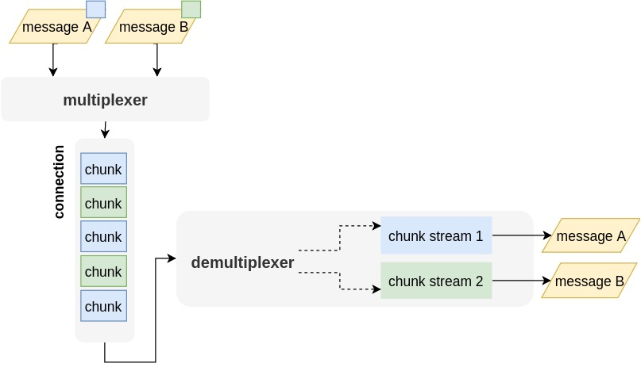

最近在处理直播相关的问题，推流端采用 RTMP 协议，因此花了些时间学习 RTMP 协议。

> 以下大部分内容都可以从 RTMP 协议规范中获得： [RTMP Specification 1.0](http://wwwimages.adobe.com/content/dam/Adobe/en/devnet/rtmp/pdf/rtmp_specification_1.0.pdf)

RTMP 协议基于 TCP，由两部分构成，一部分是 RTMP Chunks，一部分是 RTMP Message。Message 会被拆分成多个 Chunks 进行传输，这主要是为了在单条通信链路上实现不同 Message 的发送优先级控制。比如要发送 1M 的视频数据，为了避免耗时太长，所以把数据拆分为每个 10K 大小的多个 Chunk。Message 和 Chunk 的关系如下图所示（图片来自[这里](https://blog.pogrebnyak.info/what-is-rtmp-and-how-its-used-in-live-streaming/)）：



关于 RTMP 还需要了解以下几部分内容：

- 握手机制（Handshake): 用于建立 RTMP 连接；
- RTMP Chunk Stream: 用于承载 Message 的发送；
- RTMP Message Stream: 用于发送 RTMP 业务数据（比如音视频）及控制指令；
- RTMP Message Type: 区分不同的 Message 类型，比如 VIDEO/AUDIO 表示音视频数据等；

> 关于各个部分更详细的信息推荐阅读这篇文档： [What is RTMP and how it's used in live-streaming](https://blog.pogrebnyak.info/what-is-rtmp-and-how-its-used-in-live-streaming/)

其他：

- 标准的 RTMP 只支持 H264/AAC 格式的音视频，金山扩展了 RTMP 使它支持 H265，见[这里](https://github.com/ksvc/FFmpeg/wiki);
- RTMP Chunk Stream 允许传输自定义的 Chunk 数据；
- RTMP Message 不依赖 RTMP Chunk，可以替换掉 RTMP Chunk 层而只使用 RTMP Message，比如 RTMFP 使用 UDP 来传输 RTMP Message;
- RTMP Chunk 不仅可以使用 TCP 进行传输，也支持其他传输协议，比如 RTMPS 使用 TLS/SSL，RTMPT 使用 HTTP。
- 使用 `rtmpdump` 或者 `flvstreamer` 可以从 RTMP 中提取音视频数据；
- Wireshark 支持对 RTMP 协议数据进行解析；

下面是一个典型的 RTMP 数据流：

```txt
Client >> << Server

>> TCP Connection Establish <<
>> RTMP Handshake <<

>> COMMAND_AMF0 ("connect", tx1, ...) >>
<< WINDOW_ACKNOWLEDEMENT_SIZE         <<
<< SET_PEER_BANDWIDTH                 <<
<< COMMAND_AMF0 ("_result", tx1, ...) <<

>> COMMAND_AMF0 ("createStream", tx2,...) >>
<< COMMAND_AMF0 ("_result", tx2, ...)     <<

>> COMMAND_AMF0 ("publish", tx3, ... streamId, live, ...)            >>
<< COMMAND_AMF0 ("onStatus", tx3, ...code="NetStream.Publish.Start") <<

>> DATA_AMF0 ("@setDataFrame", "onMetaData", ...) >>
>> VIDEO (AVCDecoderConfigurationRecord)          >>
>> AUDIO (AAC Sequence header)                    >>
   ...
>> VIDEO  >>
>> AUDIO  >>
   ...
>> COMMAND_AMF0 ("deleteStream")   >>

>> TCP Connection Drop <<
```

----

参考文档：

- [Real-Time Messaging Protocol - Wikipedia](https://en.wikipedia.org/wiki/Real-Time_Messaging_Protocol)
- [srs/rtmp_specification_1.0.pdf at 3.0release · ossrs/srs](https://github.com/ossrs/srs/blob/3.0release/trunk/doc/rtmp_specification_1.0.pdf)
- [RTMP - MultimediaWiki](https://wiki.multimedia.cx/index.php/RTMP)
- [What is RTMP and how it's used in live-streaming](https://blog.pogrebnyak.info/what-is-rtmp-and-how-its-used-in-live-streaming/)